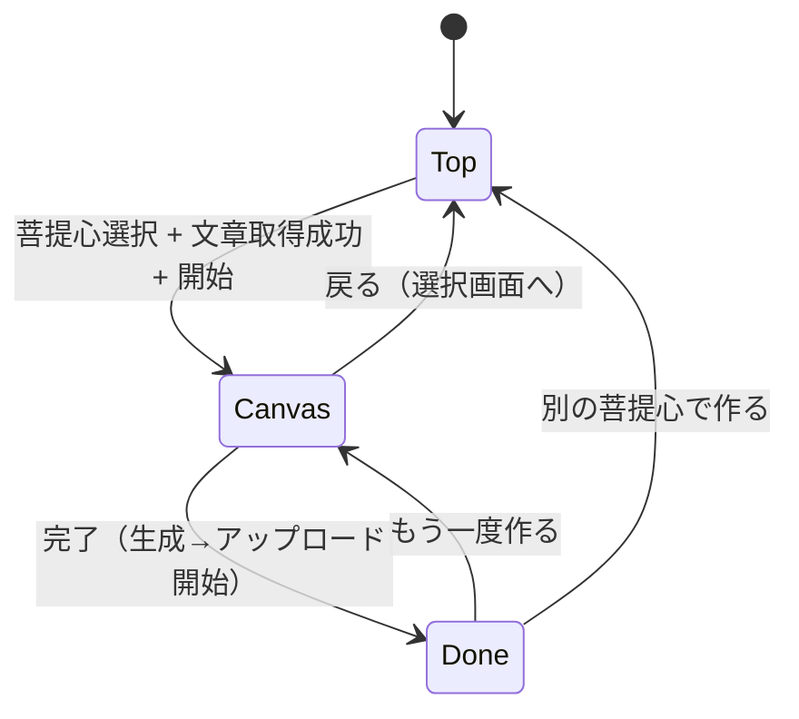
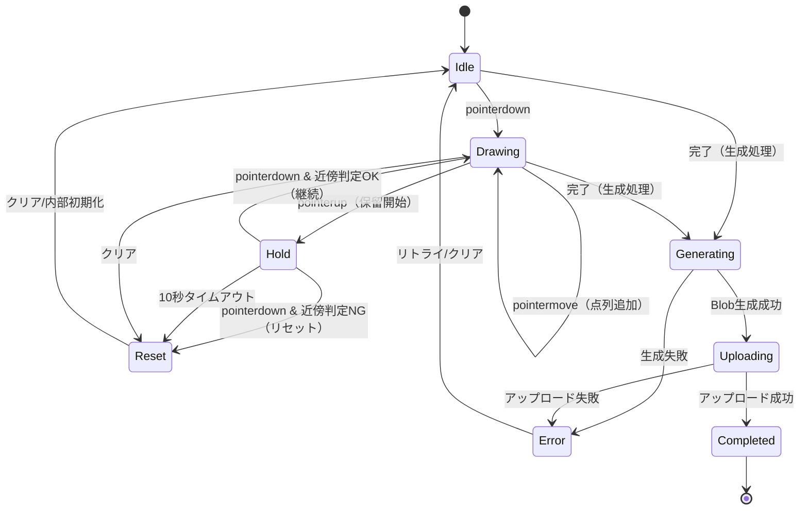

# 状態遷移図（画面・キャンバス） v0.1

## 1. 画面遷移（3画面）

※「文章取得失敗」はTop内のエラー状態で扱う（再試行）。

## 2. キャンバス操作状態（指なぞり＋10秒再開）

## 3. 近傍判定（継続条件）
- 10秒以内の再タッチ時、再タッチ位置が「前回終点」近傍なら継続
- 近傍半径R（暫定）：30px（Base 1024基準でスケール）

---

## 4. 実装メモ（バグ予防）
- `Hold` 中に「戻る」や「完了」を押された場合の優先順位を決める
  - 推奨：完了は `Drawing/Hold` どちらでも可能（自動クローズ）
- `pointercancel`（電話/通知/スクロール介入）を `pointerup` 相当に扱う
